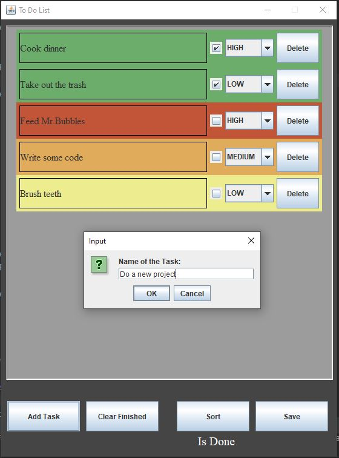
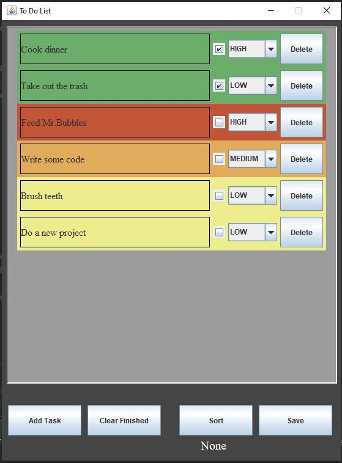
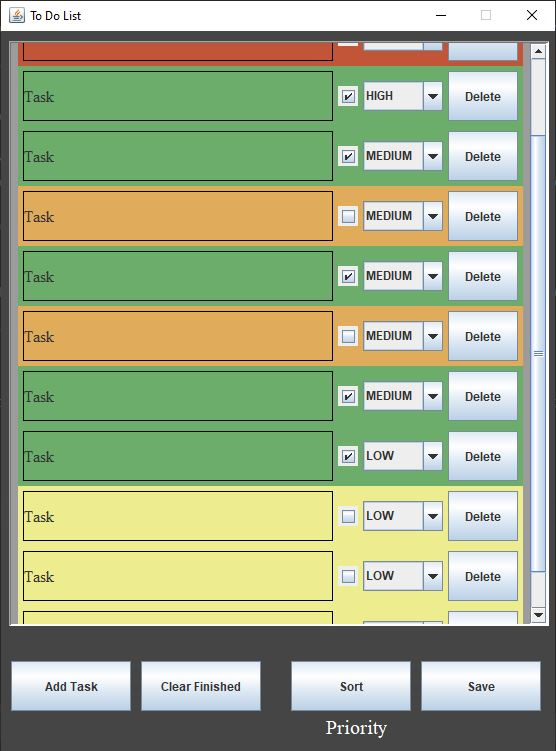

# To-Do Application
This little application is one of my projects I did during my summer vacation.
The main purpose of this project was to practice and learn.
The foundation and the base design of this application was made by [TapTap](https://github.com/curadProgrammer).
#### This is a To-Do application, where you can add new tasks, change their priority and mark them if they are done. You can also sort them with different options. The application also has a save and load function with the help of a text file.

# How to Run
To run the application on your computer, follow these steps:

1. Ensure you have JDK installed.

2. Have Git - for version control (optional but recommended).

3. Clone the repository or download the source code. You can use the following command if you have Git installed:
    ```
    git clone https://github.com/Toth-Almos/ToDo_App.git
    ```
4. Open a command prompt or terminal window.

5. Navigate to the src directory of the Java program. 
For example, if the program folder is located at C:\Projects\ToDoApp\src, you would use the following command in the command prompt:
    ```
    cd C:\Projects\ToDoApp\src
    ```

6. Once you are inside the src directory, compile the program by executing the following command:
    ```
    javac -d bin src/*.java
    ```

7. After the compilation is successful, you can run the To-Do application using the following command: 
    ```
    java -cp bin App
    ```

# Some Images


